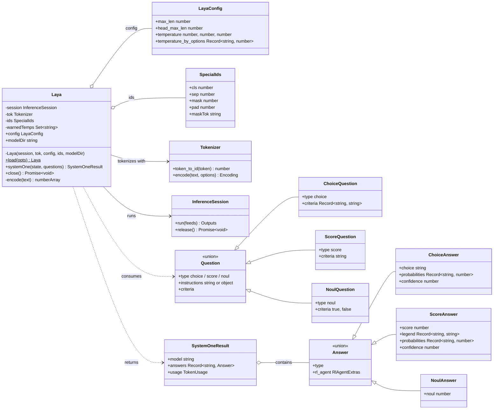
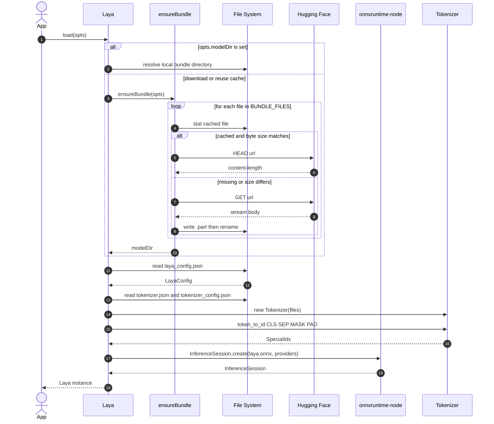
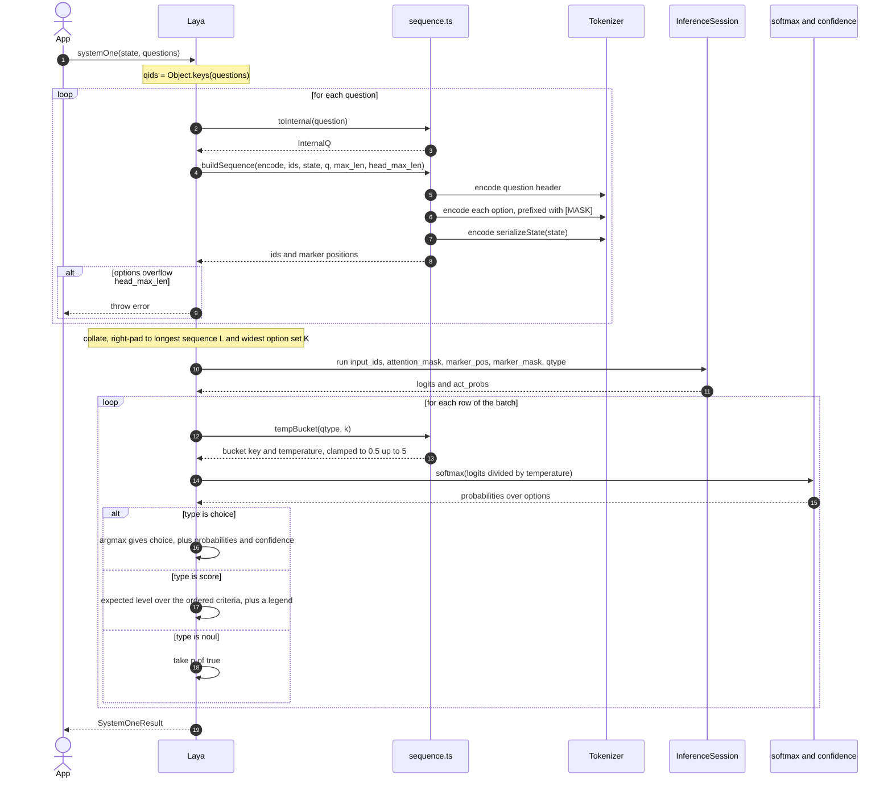
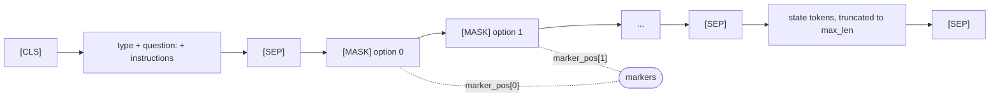
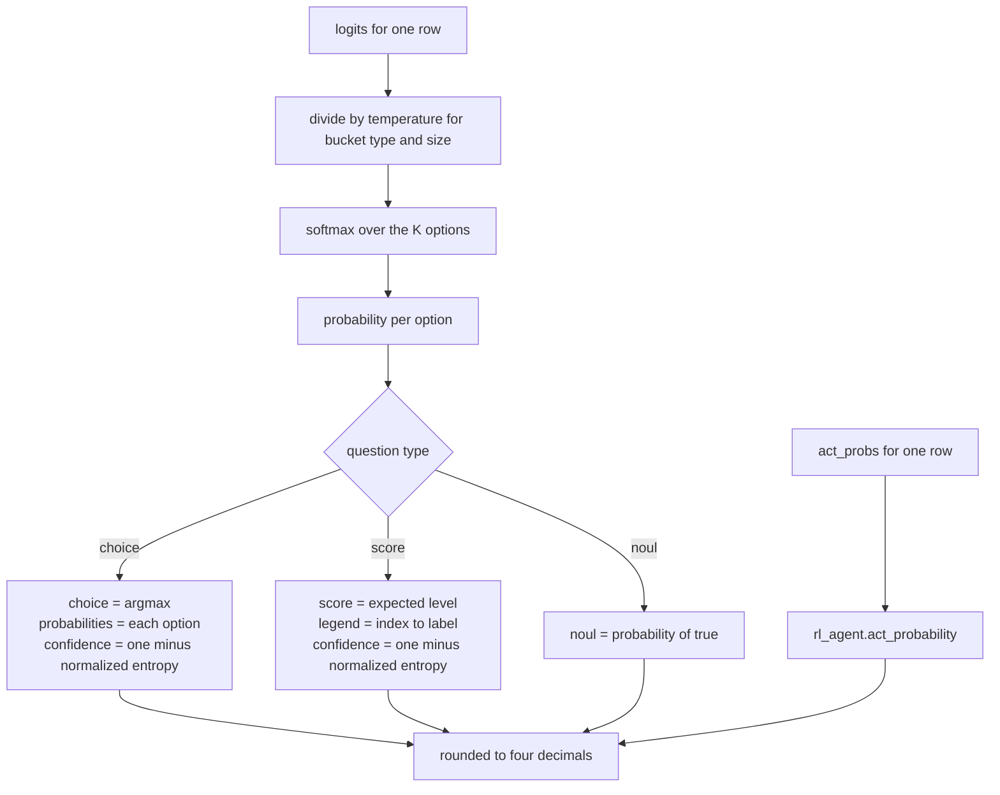

# @receptron/laya

Run **[Laya](https://huggingface.co/convaiinnovations/laya)** — the open-source,
Jev-compatible _System 1 decision model_ by Convai Innovations — from Bun, in
TypeScript.

Laya does not generate text. You hand it a state (a ticket, an email, a JSON
object) and typed questions, and it returns every answer with calibrated
probabilities in **one forward pass**:

- `choice` — pick one option, with a probability per option
- `score` — an expected level on an ordered rubric, with the distribution
- `noul` — a calibrated P(true) for a yes/no statement

This package runs the model with [ONNX Runtime](https://onnxruntime.ai/);
PyTorch and Python are not needed at runtime. The request/response shape is the
same as the Python reference implementation (`RLAgent.system_one`) and as
TypeSafe Jev's `system_one` API, and the output matches the Python
implementation to four decimal places.

## Install

If you have cloned the repository and want to install the dependencies locally,
run:

```sh
bun install
```

Bun 1.4 or newer. The ONNX weights (about 1.7 GB, fp32) are downloaded from
Hugging Face on first use and cached under `~/.cache/receptron-laya` (override
with `LAYA_CACHE`). Budget roughly 2 GB of RAM for the loaded model plus a few
hundred MB per batch of questions.

To check or run the package locally:

```sh
bun test         # unit tests; the model test runs when ./onnx holds a bundle (or LAYA_MODEL_DIR)
bun run typecheck
bun run build
bun run example:basic
```

## Models

ONNX bundles are downloaded from Hugging Face on first use and cached under
`~/.cache/receptron-laya` (override with `LAYA_CACHE`).

| Bundle           | Repo                                | Used by                                                                             |
| ---------------- | ----------------------------------- | ----------------------------------------------------------------------------------- |
| Laya, English    | `receptron/laya-onnx`               | the default; `examples/basic.ts`                                                    |
| Fallacy detector | `BryanSnappCTO/laya-fallacies-onnx` | `laya-fallacies`, the 14-way logical-fallacy classifier behind `examples/debate.ts` |

Pre-fetch a bundle without running anything:

```sh
bun run download-models                   # both bundles
bun examples/download-models.ts fallacy   # only the fallacy detector
```

`Laya.load` resolves the bundle in this order:

- `modelDir` — a local export, which wins over everything else
- `repo`, with `subfolder` and `revision` selecting inside it
- the default, `receptron/laya-onnx`

```ts
const laya = await Laya.load({ repo: "BryanSnappCTO/laya-fallacies-onnx" });
```

`receptron/laya-onnx` publishes the English checkpoint only — it carries no
`multilingual` variant — so `subfolder` is only useful for a repo that has one.

## Examples

| Example                 | Command                  | Model                               |
| ----------------------- | ------------------------ | ----------------------------------- |
| Ticket triage           | `bun run example:basic`  | Laya English                        |
| Fallacy debate detector | `bun run example:debate` | `BryanSnappCTO/laya-fallacies-onnx` |

Both read `LAYA_MODEL_DIR` (a local ONNX export), `LAYA_REPO`, `LAYA_SUBFOLDER`
and `LAYA_REVISION` (another published bundle), so either can be pointed at any
bundle without editing code.

```sh
bun run example:basic
bun run example:debate

LAYA_REPO=BryanSnappCTO/laya-fallacies-onnx bun run example:debate
LAYA_MODEL_DIR=./onnx-fallacies bun run example:debate
```

`example:debate` defaults to the fallacy bundle because the base English
checkpoint is not fine-tuned on the fallacy taxonomy. Every turn of the debate
is labelled in one batched `systemOne` call, and each answer carries the
calibrated probability of the fallacy it was classified as.

A `Makefile` wraps the common flows:

| Target                                         | Does                                                 |
| ---------------------------------------------- | ---------------------------------------------------- |
| `make install`                                 | installs bun if it is missing, then the dependencies |
| `make build`                                   | compiles to `dist/`                                  |
| `make check`                                   | typecheck, lint and tests                            |
| `make download-base` / `make download-fallacy` | pre-fetch one bundle                                 |
| `make download-models`                         | both bundles                                         |
| `make run-basic` / `make run-debate`           | the two examples                                     |
| `make clean` / `make clean-cache`              | remove `dist/` / the downloaded bundles              |

The recipes assume a POSIX shell — macOS, Linux, or Git Bash on Windows.

## Usage

```sh
bun add @receptron/laya
```

```ts
import { Laya } from "@receptron/laya";

const laya = await Laya.load();

const result = await laya.systemOne(
  { subject: "Refund not received", body: "I cancelled two weeks ago and still have no refund..." },
  {
    department: {
      type: "choice",
      instructions: "Which team should handle this ticket?",
      criteria: { billing: "payments, refunds, invoices", support: "product help and bugs", sales: "new purchases" },
    },
    urgency: {
      type: "score",
      instructions: "How urgent is this ticket?",
      criteria: ["not urgent", "somewhat urgent", "urgent", "critical"],
    },
    churn_risk: { type: "noul", instructions: "Is the customer likely to cancel or dispute?" },
  },
);

result.answers.department.choice; // "billing"
result.answers.department.probabilities; // { billing: 0.9415, support: 0.031, sales: 0.0275 }
result.answers.urgency.score; // 1.3886   (expected level, 0..3)
result.answers.churn_risk.noul; // 0.0988   (P(true))
result.usage.input_tokens; // 267

await laya.close();
```

The answer types follow the question types, so `result.answers.department` is a
`ChoiceAnswer` and `result.answers.churn_risk` a `NoulAnswer` without any
casting.

### Options

```ts
await Laya.load({
  modelDir: "./onnx", // use a local export instead of downloading (see below)
  repo: "receptron/laya-onnx", // Hugging Face repo that holds the ONNX bundle
  subfolder: "multilingual", // a variant inside that repo; receptron/laya-onnx has none
  revision: "main", // pin a commit hash for reproducible results; "main" follows the repo
  cacheDir: "/var/cache/laya",
  token: process.env.HF_TOKEN, // for private repos
  onProgress: ({ file, received, total }) => {}, // download progress
  executionProviders: ["cpu"], // onnxruntime-node execution providers
  sessionOptions: { intraOpNumThreads: 4 },
});
```

Every question of one `systemOne` call is batched into a single run; a call with
three questions takes about 140 ms on an Apple M1 Pro CPU once the model is
warm.

## Exporting the ONNX bundle yourself

`export/export_onnx.py` turns the Hugging Face checkpoint (ModernBERT encoder +
Laya's decision head) into one ONNX graph and copies the tokenizer and
calibration values next to it. You only need this to build a bundle from a newer
checkpoint or from a variant that is not published:

```sh
cd export
uv venv -p 3.12 .venv
uv pip install -p .venv/bin/python torch transformers safetensors onnx onnxscript onnxruntime huggingface_hub
.venv/bin/python -c "from huggingface_hub import snapshot_download; snapshot_download('convaiinnovations/laya', local_dir='model', allow_patterns=['model.safetensors','encoder/*','tokenizer/*','rl_agent_config.json','rl_common.py','rl_agent_api.py'])"
.venv/bin/python export_onnx.py model ../onnx   # prints the max logit difference vs. PyTorch (≈1e-5)
```

Then `Laya.load({ modelDir: "./onnx" })`. The bundle is the five files listed in
`BUNDLE_FILES`: `laya.onnx`, `laya.onnx.data`, `laya_config.json`,
`tokenizer/tokenizer.json`, `tokenizer/tokenizer_config.json`.

## Limits

- Each question's options must fit in `head_max_len` (192) tokens; `systemOne`
  throws otherwise. Fewer than about 20 options per `choice` question is the
  model's own recommendation.
- The state is truncated to `max_len` (512 tokens for the English checkpoint)
  after the question header.
- A JSON state is serialized like Python's `json.dumps(ensure_ascii=False)` so
  that tokens match the reference implementation; non-integer numbers may format
  differently between JS and Python.

## Diagrams

These diagrams model the runtime objects and the two main flows of the package.

### Object model

The `Laya` instance owns everything needed to answer a request: the calibration
config, the tokenizer, the ONNX session, and the special-token ids. A
`systemOne` call consumes `Question` objects and produces `Answer` objects, one
concrete answer type per question type.



### Sequence: `Laya.load()`

Cold start. Either a local `modelDir` is used directly, or the bundle is fetched
from Hugging Face into the cache by `ensureBundle` before the tokenizer and the
ONNX session are built.



### Sequence: `systemOne()`

One state, many questions, one forward pass. Each question is rendered into a
token sequence with a `[MASK]` marker per option, the questions are collated
into a single batch, and the model's logits are turned into typed answers with a
per-cardinality temperature and a Jev-style confidence.



### Sequence layout

`buildSequence` packs the question header, the marked options, and the state
into one sequence. Marker positions point at each option's leading `[MASK]`
token, which is how the decision head reads one option embedding per option.



The header and options share the `head_max_len` budget; when the options are too
long they are shrunk evenly, and the header absorbs what is left over. The state
fills the remainder up to `max_len`.

### Answer decoding

Each option contributes one logit. Dividing by the temperature for the
question's `type:size` bucket and applying a softmax yields the option
distribution; the question type decides how that distribution becomes an answer.



## License

Apache-2.0. The Laya model weights are published by Convai Innovations under the
Apache-2.0 licence, and the fine-tuned derivatives kept in this repository (for
example `laya-fallacies`) are redistributed under the same licence. The encoder
weights come from [ModernBERT](https://huggingface.co/answerdotai/ModernBERT-large),
also Apache-2.0. See `LICENSE` for the full text.
